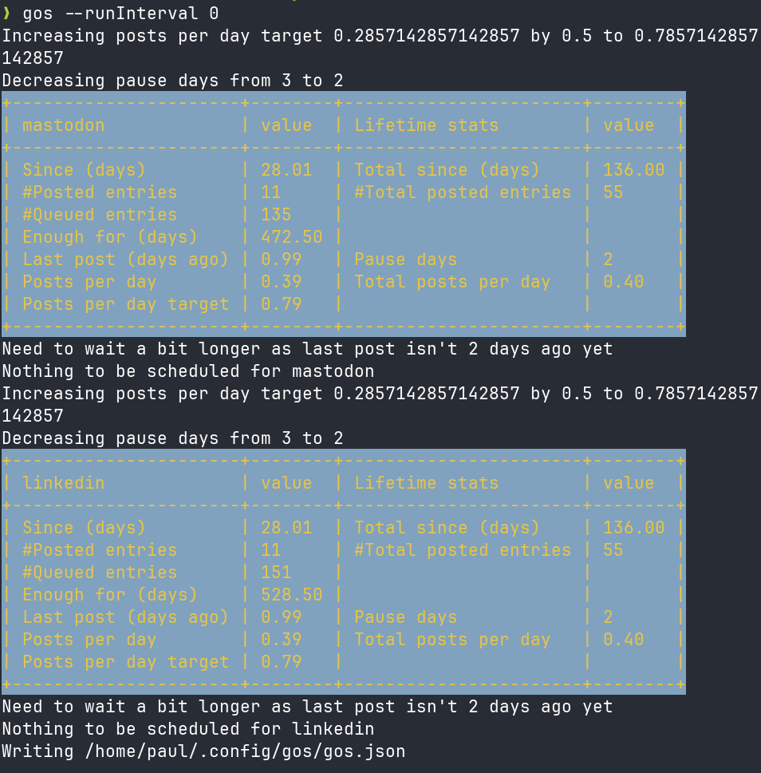

# Gos (Go Social Media)


Gos is a Go-based replacement for Buffer.com (which I wrote in Go), providing the ability to schedule and manage social media posts from the command line. It can be run, for example, every time you open a new shell or only once every N hours when you open a new shell.

I used Buffer.com to schedule and post my social media messages for a long time. However, over time, there were more problems with that service, including a slow and unintuitive UI, and the free version only allows scheduling up to 10 messages. At one point, they started to integrate an AI assistant (which would seemingly randomly pop up in separate JavaScript input boxes), and then I had enough and decided I had to build my own social sharing tool—and Gos was born.

## Gos features

* Mastodon and LinkedIn support.
* Dry run mode for testing posts without actually publishing.
* Configurable via flags and environment variables.
* Easy to integrate into automated workflows.
* OAuth2 authentication for LinkedIn.
* Image previews for LinkedIn posts.

## Installation

## Prequisites

The prerequisites are:

* Go (version 1.24 or later)
* Supported browsers like Firefox, Chrome, etc for oauth2.

### Build and install

Clone the repository:

```bash
git clone https://codeberg.org/snonux/gos.git
cd gos
```

Build the binaries:

```bash
go build -o gos ./cmd/gos
go build -o gosc ./cmd/gosc
sudo mv gos ~/go/bin
sudo mv gosc ~/go/bin
```

Or, if you want to use the `Taskfile`:

```bash
go-task install
```

## Configuration

Gos requires a configuration file to store API secrets and OAuth2 credentials for each supported social media platform. The configuration is managed using a Secrets structure, which is stored as a JSON file in `~/.config/gos/gos.json`.

Example Configuration File (`~/.config/gos/gos.json`):

```json
{
  "MastodonURL": "https://mastodon.example.com",
  "MastodonAccessToken": "your-mastodon-access-token",
  "LinkedInClientID": "your-linkedin-client-id",
  "LinkedInSecret": "your-linkedin-client-secret",
  "LinkedInRedirectURL": "http://localhost:8080/callback",
}
```

### Configuration fields

* `MastodonURL`: The base URL of the Mastodon instance you are using (e.g., https://mastodon.social).
* `MastodonAccessToken`: Your access token for the Mastodon API, which is used to authenticate your posts.
* `LinkedInClientID`: The client ID for your LinkedIn app, which is needed for OAuth2 authentication.
* `LinkedInSecret`: The client secret for your LinkedIn app.
* `LinkedInRedirectURL`: The redirect URL configured for handling OAuth2 responses.
* `LinkedInAccessToken`: Gos will automatically update this after successful OAuth2 authentication with LinkedIn.
* `LinkedInPersonID`: Gos will automatically update this after successful OAuth2 authentication with LinkedIn.

### Automatically managed fields

Once you finish the OAuth2 setup (after the initial run of `gos`), some fields—like `LinkedInAccessToken` and `LinkedInPersonID` will get filled in automatically. To check if everything's working without actually posting anything, you can run the app in dry run mode with the `--dry` option. After OAuth2 is successful, the file will be updated with `LinkedInClientID` and `LinkedInAccessToken`. If the access token expires, it will go through the OAuth2 process again.

## Invoking Gos

Gos is a command-line tool for posting updates to multiple social media platforms. You can run it with various flags to customize its behaviour, such as posting in dry run mode, limiting posts by size, or targeting specific platforms.

Flags control the tool's behavior. Below are several common ways to invoke Gos and descriptions of the available flags.

### Common flags

* `-dry`: Run the application in dry run mode, simulating operations without making any changes.
* `-version`: Display the current version of the application.
* `-compose`: Compose a new entry. Default is set by `composeEntryDefault`.
* `-gosDir`: Specify the directory for Gos' queue and database files. The default is `~/.gosdir`.
* `—cacheDir`: Specify the directory for Gos' cache. The default is based on the `gosDir` path.
* `-browser`: Choose the browser for OAuth2 processes. The default is "firefox".
* `-configPath`: Path to the configuration file. Default is `~/.config/gos/gos.json`.
* `—platforms`: The enabled platforms and their post size limits. The default is "Mastodon:500,LinkedIn:1000."
* `-target`: Target number of posts per week. The default is 2.
* `-minQueued`: Minimum number of queued items before a warning message is printed. The default is 4.
* `-maxDaysQueued`: Maximum number of days' worth of queued posts before the target increases and pauseDays decreases. The default is 365.
* `-pauseDays`: Number of days until the next post can be submitted. The default is 3.
* `-runInterval`: Number of hours until the next post run. The default is 12.
* `—lookback`: The number of days to look back in time to review posting history. The default is 30.
* `-geminiSummaryFor`: Generate a Gemini Gemtext format summary specifying months as a comma-separated string.
* `-geminiCapsules`: Comma-separated list of Gemini capsules. Used to detect Gemtext links.
* `-gemtexterEnable`: Add special tags for Gemtexter, the static site generator, to the Gemini Gemtext summary.
* `-dev`: For internal development purposes only.

### Examples

*Dry run mode*

Dry run mode lets you simulate the entire posting process without actually sending the posts. This is useful for testing configurations or seeing what would happen before making real posts.

```bash
./gos --dry
```

*Normal run*

Sharing to all platforms is as simple as the following (assuming it is configured correctly):

```bash
./gos 
```

:-)



However, you will notice that no messages are queued to be posted yet (not like on the screenshot yet!). Relax and read on...

## Composing messages to be posted

To post messages using Gos, you need to create text files containing the posts' content. These files are placed inside the directory specified by the `--gosDir` flag (the default directory is `~/.gosdir`). Each text file represents a single post and must have the .txt extension. You can also simply run `gos --compose` to compose a new entry. It will open simply a new text file in `gosDir`.

### Basic structure of a message file

Each text file should contain the message you want to post on the specified platforms. That's it. Example of a Basic Post File `~/.gosdir/samplepost.txt`:

```bash
This is a sample message to be posted on social media platforms.

Maybe add a link here: https://foo.zone

#foo #cool #gos #golang
```

The message is just arbitrary text, and, besides inline share tags (see later in this document) at the beginning, Gos does not parse any of the content other than ensuring the overall allowed size for the social media platform isn't exceeded. If it exceeds the limit, Gos will prompt you to edit the post using your standard text editor (as specified by the `EDITOR` environment variable). When posting, all the hyperlinks, hashtags, etc., are interpreted by the social platforms themselves (e.g., Mastodon, LinkedIn).

### Adding share tags in the filename

You can control which platforms a post is shared to, and manage other behaviors using tags embedded in the filename. Add tags in the format `share:platform1.-platform2` to target specific platforms within the filename. This instructs Gos to share the message only to `platform1` (e.g., Mastodon) and explicitly exclude `platform2` (e.g., LinkedIn). You can include multiple platforms by listing them after `share:`, separated by a `.`. Use the `-` symbol to exclude a platform.

Currently, only `linkedin` and `mastodon` are supported, and the shortcuts `li` and `ma` also work.

**Examples:**

* To share only on Mastodon: `~/.gosdir/foopost.share:mastodon.txt`
* To exclude sharing on LinkedIn: `~/.gosdir/foopost.share:-linkedin.txt`
* To explicitly share on both LinkedIn and Mastodon: `~/.gosdir/foopost.share:linkedin:mastodon.txt`
* To explicitly share only on LinkedIn and exclude Mastodon: `~/.gosdir/foopost.share:linkedin:-mastodon.txt`

Besides encoding share tags in the filename, they can also be embedded within the `.txt` file content to be queued. For example, a file named `~/.gosdir/foopost.txt` with the following content:

```
share:mastodon The content of the post here
```

or

```
share:mastodon

The content of the post is here https://some.foo/link

#some #hashtags
```

Gos will parse this content, extract the tags, and queue it as `~/.gosdir/db/platforms/mastodon/foopost.share:mastodon.extracted.txt....` (see how post queueing works later in this document).

### Using the `prio` tag

Gos randomly picks any queued message without any specific order or priority. However, you can assign a higher priority to a message. The priority determines the order in which posts are processed, with messages without a priority tag being posted last and those with priority tags being posted first. If multiple messages have the priority tag, then a random message will be selected from them.

*Examples using the Priority tag:* 

* To share only on Mastodon: `~/.gosdir/foopost.prio.share:mastodon.txt`
* To not share on LinkedIn: `~/.gosdir/foopost.prio.share:-linkedin.txt`
* To explicitly share on both: `~/.gosdir/foopost.prio.share:linkedin:mastodon.txt`
* To explicitly share on only linkedin: `~/.gosdir/foopost.prio.share:linkedin:-mastodon.txt`

There is more: you can also use the `soon` tag. It is almost the same as the `prio` tag, just with one lower priority.

### More tags

* A `.ask.` in the filename will prompt you to choose whether to queue, edit, or delete a file before queuing it.
* A `.now.` in the filename will schedule a post immediately, regardless of the target status.

So you could also have filenames like those: 

* `~/.gosdir/foopost.ask.txt`
* `~/.gosdir/foopost.now.txt`
* `~/.gosdir/foopost.ask.share:mastodon.txt`
* `~/.gosdir/foopost.ask.prio.share:mastodon.txt`
* `~/.gosdir/foopost.ask.now.share:-mastodon.txt`
* `~/.gosdir/foopost.now.share:-linkedin.txt`

etc...

All of the above also works with embedded tags. E.g.:

```
share:mastodon,ask,prio Hello wold :-)
```

or 

```
share:mastodon,ask,prio

Hello World :-)
```

### The `gosc` binary

`gosc` stands for Gos Composer and will simply launch your `$EDITOR` on a new text file in the `gosDir`. It's the same as running `gos --compose`, really. It is a quick way of composing new posts. Once composed, it will ask for your confirmation on whether the message should be queued or not.

## How queueing works in gos

When you place a message file in the `gosDir`, Gos processes it by moving the message through a queueing system before posting it to the target social media platforms. A message's lifecycle includes several key stages, from creation to posting, all managed through the `./db/platforms/PLATFORM` directories.

### Step-by-step queueing process

1. Inserting a Message into `gosDir`: You start by creating a text file that represents your post (e.g., `foo.txt`) and placing it in the `gosDir`. When Gos runs, this file is processed. The easiest way is to use `gosc` here.

2. Moving to the Queue: Upon running Gos, the tool identifies the message in the `gosDir` and places it into the queue for the specified platform. The message is moved into the appropriate directory for each platform in `./db/platforms/PLATFORM`. During this stage, the message file is renamed to include a timestamp indicating when it was queued and given a `.queued` extension.

*Example: If a message is queued for LinkedIn, the filename might look like this:*

```
~/.gosdir/db/platforms/linkedin/foo.share:-mastodon.txt.20241022-102343.queued
```

3. Posting the Message: Once a message is placed in the queue, Gos posts it to the specified social media platforms. 

4. Renaming to `.posted`: After a message is successfully posted to a platform, the corresponding `.queued` file is renamed to have a `.posted` extension, and the filename timestamp is also updated. This signals that the post has been processed and published.

*Example - After a successful post to LinkedIn, the message file might look like this:*

```
./db/platforms/linkedin/foo.share:-mastodon.txt.20241112-121323.posted
```

## How message selection works in gos

Gos decides which messages to post using a combination of priority, platform-specific tags, and timing rules. The message selection process ensures that messages are posted according to your configured cadence and targets while respecting pauses between posts and previously met goals.

The key factors in message selection are:

* Target Number of Posts Per Week: The `-target` flag defines how many posts per week should be made to a specific platform. This target helps Gos manage the posting rate, ensuring that the right number of posts are made without exceeding the desired frequency. 
* Post History Lookback: The `-lookback` flag tells Gos how many days back to look in the post history to calculate whether the weekly post target has already been met. It ensures that previously posted content is considered before deciding to queue up another message.
* Message Priority: Messages with no priority value are processed after those with priority. If two messages have the same priority, one is selected randomly.
* Pause Between Posts: The `-pauseDays` flag allows you to specify a minimum number of days to wait between posts for the same platform. This prevents oversaturation of content and ensures that posts are spread out over time.

## Post summary as gemini gemtext

For my blog, I want to post a summary of all the social messages posted over the last couple of months. For an example, have a look here: https://foo.zone/gemfeed/2025-01-01-posts-from-october-to-december-2024.html. To accomplish this, run:

```sh
gos --geminiSummaryFor 202410,202411,202412
```

This outputs the summary for the three specified months, as shown in the example. The summary includes posts from all social media networks but removes duplicates.

Also, add the `--gemtexterEnable` flag, if you are using [Gemtexter](https://codeberg.org/snonux/gemtexter):

```sh
gos --gemtexterEnable --geminiSummaryFor 202410,202411,202412
```

In case there are HTTP links that translate directly to the Geminispace for certain capsules, specify the Gemini capsules as a comma-separated list as follows:

```sh
gos --gemtexterEnable --geminiSummaryFor 202410,202411,202412 --geminiCapsules "foo.zone,paul.buetow.org"
```

It will then also generate Gemini Gemtext links in the summary page and flag them with `(Gemini)`.
